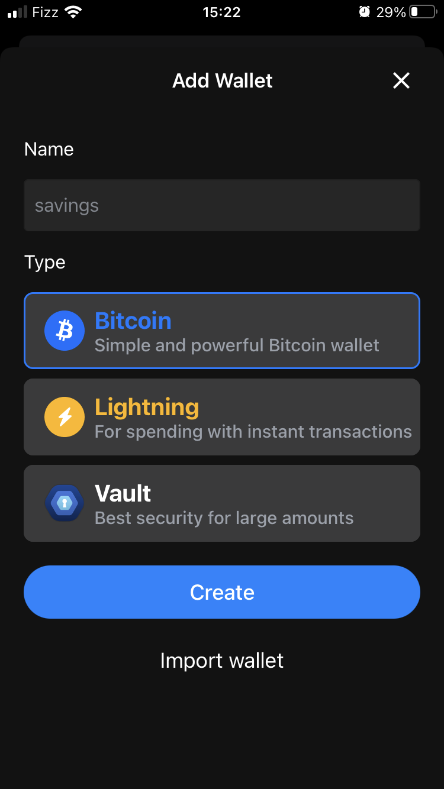
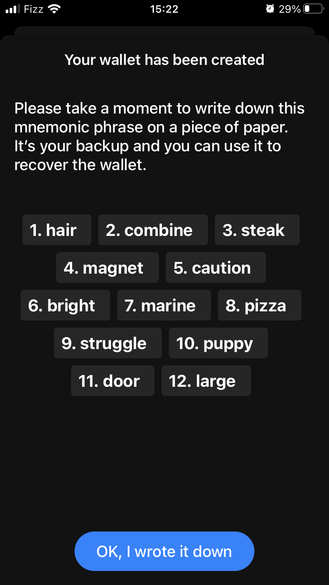
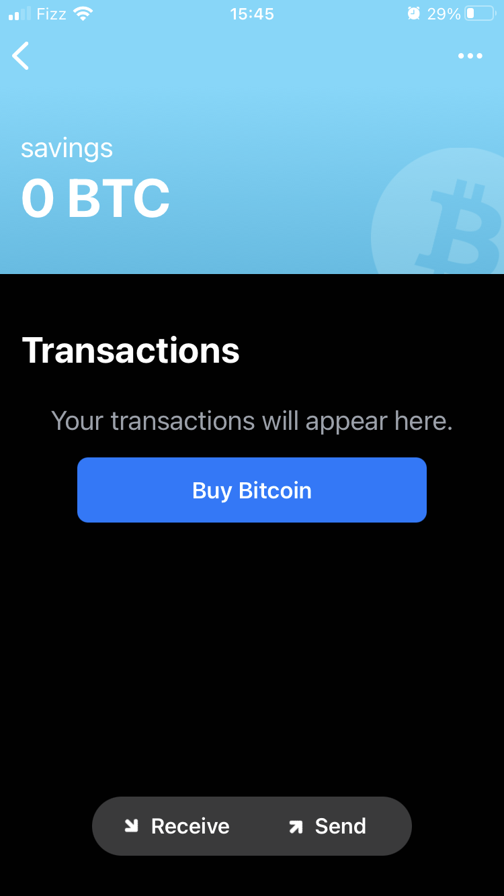
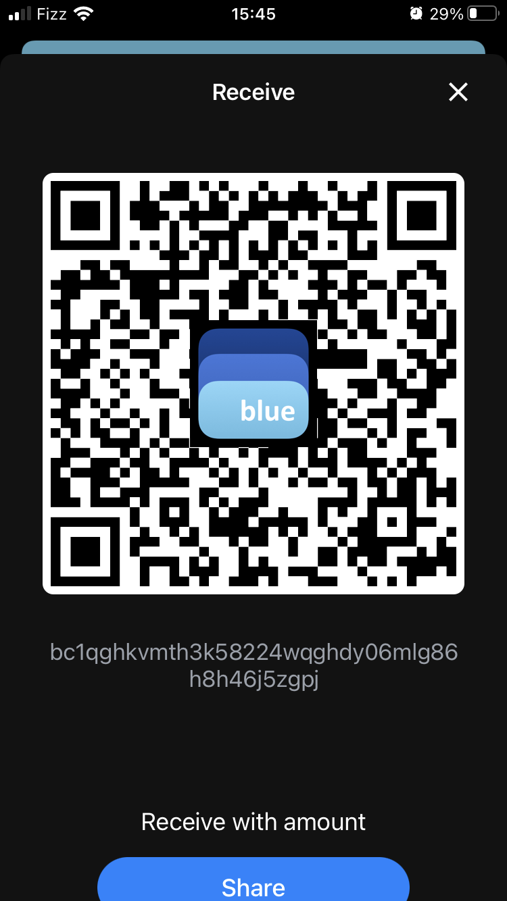

# onboard

The purpose of this page is to help any newcomer get setup with a bitcoin wallet. Before we start, here are a few assumptions we are making :

- you have access to a smartphone
- you want to install "[BlueWallet](https://bluewallet.io/)"

## Wallet choice

We decided to write this guide with [BlueWallet](https://bluewallet.io/) in mind as we believe it to be the easiest wallet to get you onboarded. More guides involving other wallets might become available later (pull requests welcome).

## Install the wallet

### android

    TODO : better android support

1. Open android's appstore.
1. Search for "blue wallet".
1. Install the app.

### iPhone

1. Open apple's appstore.
1. Hit the search button (usually on the bottom right) and type "blue wallet".
    - Optionally, click the following link [which will bring you to BlueWallet directly](https://itunes.apple.com/app/bluewallet-bitcoin-wallet/id1376878040). 
**Only install [BlueWallet](https://bluewallet.io/). Not something that looks like BlueWallet. Not CyanWallet. Not TheOneAndOnlyBlueWallet. _BlueWallet_. Beware of malicious apps.**

## Start the wallet app

1. Open [BlueWallet](https://bluewallet.io/) and click on "Add now" (this only shows up when you don't already have a wallet setup). 
    - If for some reason the "Add now" button is not available, click on the "+" icon in the top right corner.
1. Enter a name for the wallet. Name it something relevant like "savings" (remember, [bitcoin is a savings technology :)](https://twitter.com/BitcoinIsSaving))
1. For the type of account, select "Bitcoin".
1. Click on "Create".
1. Upon clicking create, you will be presented with 12 words (seed words). Save those in a safe place (see below for warnings regarding adequately storing a bitcoin private key). 

Congratulations! You are now the proud owner of a bitcoin wallet/account and can start transacting on the Bitcoin network

### On storing seed words (the 12 words you wrote down earlier)

Think of these words as the **ONLY** "key" that can open your bitcoin "safe deposit box". If you lose them, you lose access to your bitcoin. If you share them (or they get stolen somehow), that person now has access to your bitcoin. The amount of energy you put into securing this key should be equivalent to the value that you store in your wallet (e.g. it's ok to save these on dropbox if you only put a few bucks on there to play with but if you are putting a few hundred dollars worth of bitcoin on there, you might want to think a bit more about how to properly secure your key. However, this is outside the scope of this article.

    TODO : add documentation regarding storing a bitcoin private key

## Receive your first bitcoin

In order to fund your new wallet with bitcoins, you need to know someone who can send you some satoshis (the smallest bitcoin unit, 0.00000001 btc) or buy some sats from some bitcoin onramp. Here are a few recommandations :

- [Shakepay](https://shakepay.me/r/8SOJEYV) (Canada, easiest, uses my personal referral link to get you and me 10$ each)
- [Bull Bitcoin](https://bullbitcoin.com/) (Canada)
- [Swan Bitcoin](https://www.swanbitcoin.com/) (United States)

Once you are ready to receive your first sats :

- Open the [BlueWallet](https://bluewallet.io/) app.
- In [BlueWallet](https://bluewallet.io/), click on the wallet you just created. 
- On the bottom, click on "receive".
- You will be presented with a QR code and a strange looking string (e.g. bc1hiuesijeiw...). The long string is your bitcoin address and the QR code is the visual representation of that same address. This address can be used by you or someone else trying to send you sats. Make sure you copy it and don't try to enter it manually, this is a bad idea. 
- This next step will be different depending on which onramp you are using. In general, you need to enter an amount to send in btc (e.g. 0.001 btc or 100000 sats) and enter the destination address you copied earlier.
- You might also have to enter a fee. Ideally, a good fee will be pre-selected so use that for now.
- When ready, press send and in a matter of seconds, you should see the funds appear in your [BlueWallet](https://bluewallet.io/) wallet.

Congratulations! You have now received your first bitcoins.
